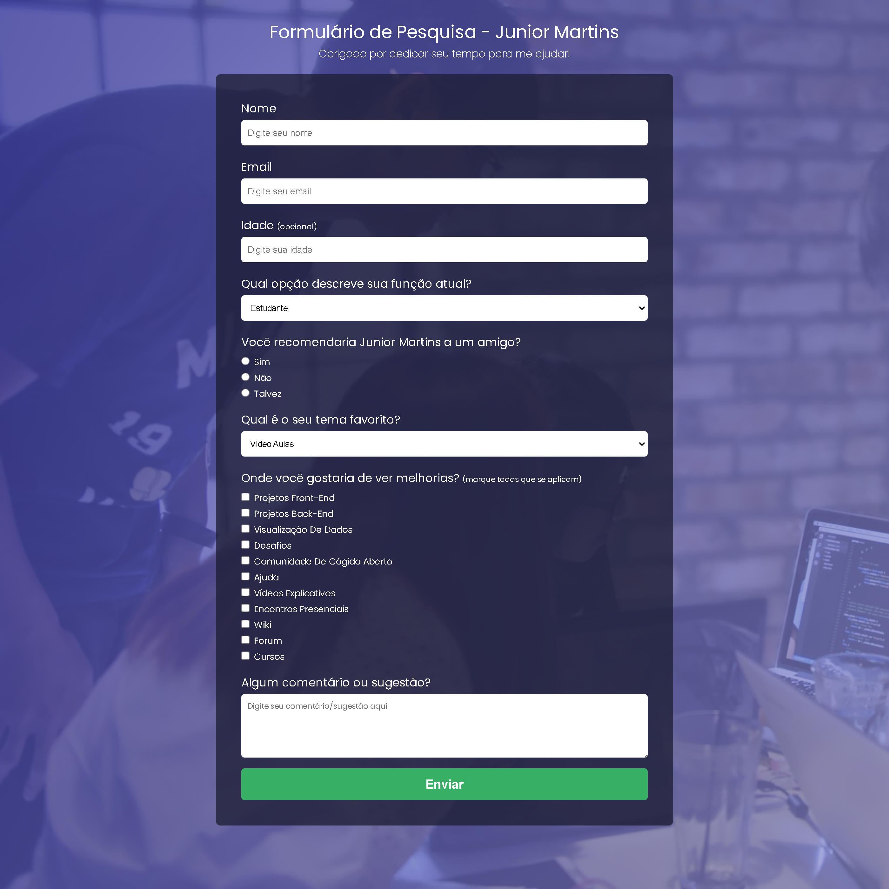
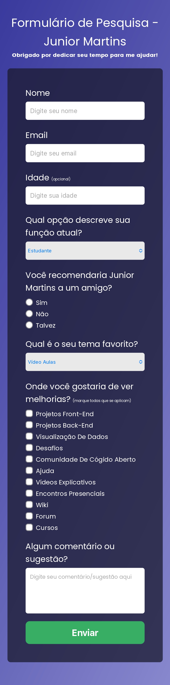

<h1>
    Formulário De Pesquisa
</h1>

    Um formulário simples com referência do canal no youtube Attekita Dev.

<h2>
    Objetivo:
</h2>

    Colocar em prática meus conhecimentos em HTML5/CSS3/Media Queries.

<h2>
    Desktop:
</h2>

 
<h2>
    Mobile:
</h2>

 
<h2>
    Responsividade:
</h2>

 
<h2>
    Capturas De Tela:
</h2>
<h3>Desktop</h3>

<h3>Mobile</h3>

<h4>
    Obrigado pela visualização do meu projeto.  
    Estou sempre disposto a sugestões de melhorias!!
</h4>
